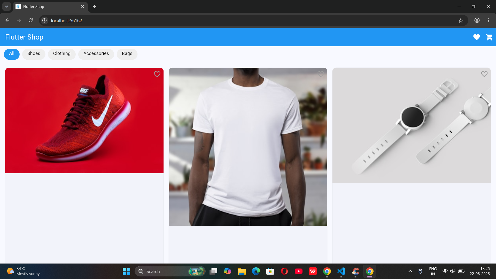
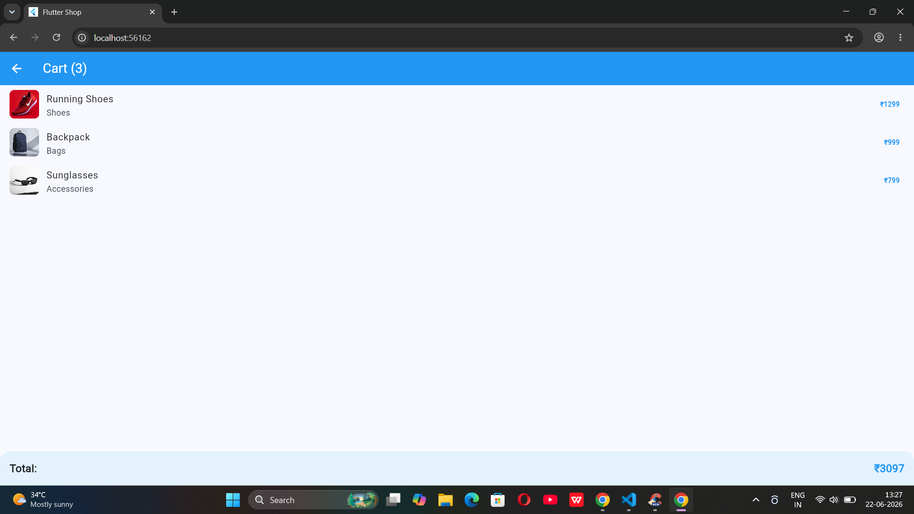

# Flutter Shop App 🛒

A modern Flutter shopping app with real product images, category filtering, cart, and wishlist features.

## Screenshots

| Home Screen | Cart Screen |
|---|---|
|  |  |

## Features
- 🏠 Product grid with real product images
- 🔵 Category filters (Shoes, Clothing, Accessories, Bags)
- 🛒 Add to cart with live counter badge
- ❤️ Wishlist with toggle and counter badge
- 💰 Cart total calculation
- 📱 Clean Material 3 UI with blue theme

## How to Run

```bash
git clone https://github.com/swethamahesh552/flutter-shop-app.git
cd flutter-shop-app
flutter pub get
flutter run
```

## Tech Stack
- Flutter
- Dart
- Material 3
- Unsplash API (product images)

## Project Structure
lib/

├── main.dart

├── models/

│   └── product_model.dart

└── screens/

├── home_screen.dart

├── cart_screen.dart

└── wishlist_page.dart
## Roadmap
- [ ] Add product detail screen
- [ ] Add search functionality
- [ ] Add local storage for cart
- [ ] Add payment screen

## Author
Swetha — [github.com/swethamahesh552](https://github.com/swethamahesh552)